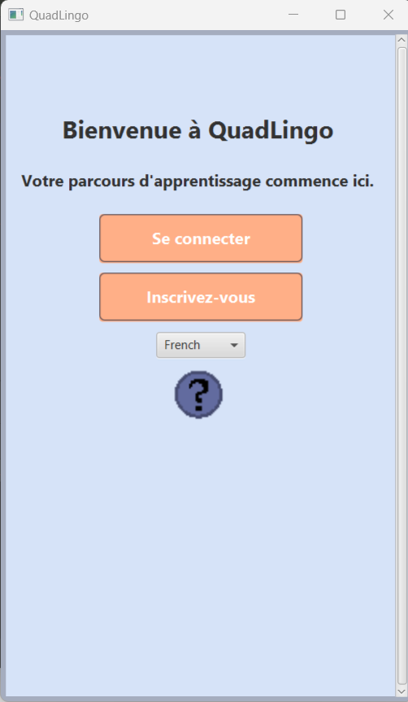
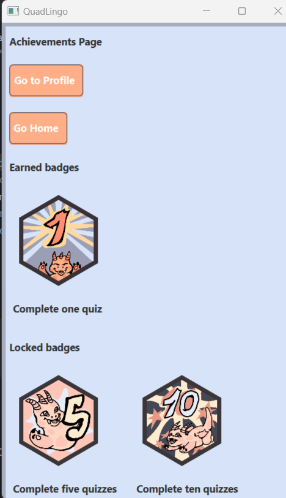
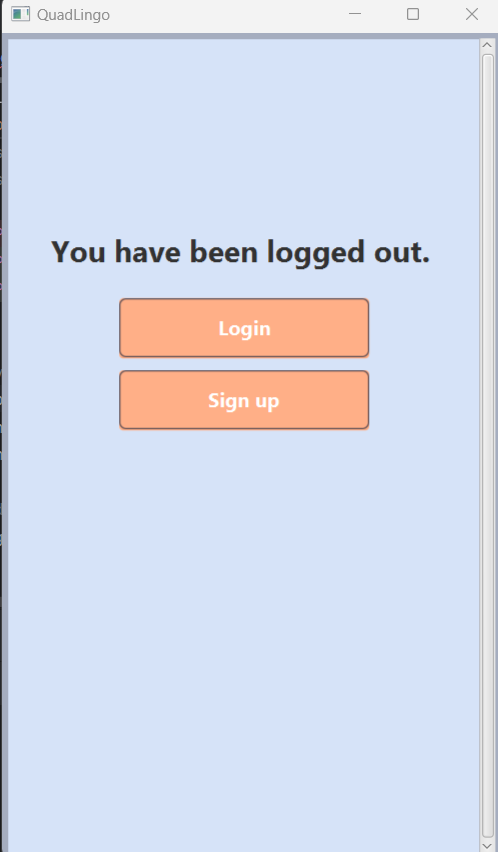
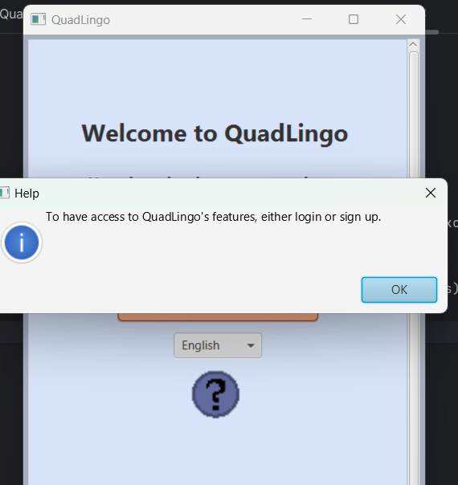

# Demo Gallery

Here are screenshots showcasing features of the **QuadLingo** application (missing home page screenshot).

---

### Index Screen in Different Languages

  
  
  
  

---

### Quiz Library and Example Quiz

  
  

---

### Progress Tracking and Achievements

  
  

---

### Profile Page and Logged Out View

  
  

---

### Error Message Example

